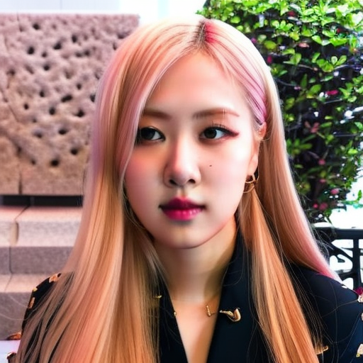

# LoRA training for human portrait generation

This repository provides some pre-processing, finetuning, evaluating scripts of LoRA training process. Both [naive LoRA training](https://huggingface.co/docs/diffusers/training/lora) and [Dreambooth LoRA training](https://huggingface.co/docs/diffusers/training/dreambooth) are also supported. The quality of generated image depends mainly on quality of training images. The more realistic image you collect, the more quality of generated image you can get.

|                     Prompt                      |                Image 1                |                Image 2                |                Image 3                |                Image 4                |                Image 5                |
| :---------------------------------------------: | :-----------------------------------: | :-----------------------------------: | :-----------------------------------: | :-----------------------------------: | :-----------------------------------: |
|   tranthanh, photo of a man, solo, realistic    |  |  |  |  |  |
|         rose_bp, photo of a girl, solo          |         |         |         |         |         |
| leeminho, photo of a man, solo, mustache, smoke |    |    |    |    |    |

# Uses

## Direct Use

The model is intended for research purposes only. Possible research areas and tasks include

- Safe deployment of models which have the potential to generate harmful content.
- Probing and understanding the limitations and biases of generative models.
- Generation of artworks and use in design and other artistic processes.
- Applications in educational or creative tools.
- Research on generative models.

Excluded uses are described below.

### Misuse, Malicious Use, and Out-of-Scope Use

The model should not be used to intentionally create or disseminate images that create hostile or alienating environments for people. This includes generating images that people would foreseeably find disturbing, distressing, or offensive; or content that propagates historical or current stereotypes.

#### Out-of-Scope Use

The model was not trained to be factual or true representations of people or events, and therefore using the model to generate such content is out-of-scope for the abilities of this model.

#### Misuse and Malicious Use

Using the model to generate content that is cruel to individuals is a misuse of this model. This includes, but is not limited to:

- Generating demeaning, dehumanizing, or otherwise harmful representations of people or their environments, cultures, religions, etc.
- Intentionally promoting or propagating discriminatory content or harmful stereotypes.
- Impersonating individuals without their consent.
- Sexual content without consent of the people who might see it.
- Mis- and disinformation
- Representations of egregious violence and gore
- Sharing of copyrighted or licensed material in violation of its terms of use.
- Sharing content that is an alteration of copyrighted or licensed material in violation of its terms of use.

# Examples

_I recommend you to use Dreambooth LoRA training technique to get high quality result_

## Install packages

```
pip install -r requirements.txt
```

## Dreambooth LoRA training

```
$ export CUDA_VISIBLE_DEVICES=5
$ accelerate launch train_dreambooth_lora.py \
  --pretrained_model_name_or_path=stablediffusionapi/realistic-vision-v51 \
  --instance_data_dir=assets/dreambooth/rose_bp \
  --train_text_encoder \
  --rank 8 \
  --dataloader_num_workers=8 \
  --resolution=512 \
  --train_batch_size=4 \
  --gradient_accumulation_steps=4 \
  --max_train_steps=15000 \
  --learning_rate=1e-04 \
  --max_grad_norm=1 \
  --lr_scheduler="cosine" --lr_warmup_steps=0 \
  --output_dir=saved/dreambooth/rose_bp \
  --report_to=wandb \
  --validation_prompt="rose_bp, photo of a girl, solo" \
  --seed=1337 \
  --checkpointing_steps=80 \
  --validation_epochs=10 \
  --instance_prompt="rose_bp" \
  --class_prompt="woman"
```

## Naive LoRA training

### Image captioning

Use [BLIP captioning](https://huggingface.co/Salesforce/blip-image-captioning-base) to caption image in training directory

```
import torch
from transformers import BlipProcessor, BlipForConditionalGeneration
from tqdm import tqdm
import glob
import json
import os
from PIL import Image

device = 'cuda:0'
dtype = torch.float16


# define model, pipeline
processor = BlipProcessor.from_pretrained("Salesforce/blip-image-captioning-base")
image2text_model = BlipForConditionalGeneration.from_pretrained("Salesforce/blip-image-captioning-base")
image2text_model.to(device)

# Image captioning by BLIP captioning
input_dir = 'assets/naive_lora/rose_bp'
data_file = 'assets/naive_lora/rose_bp/metadata.jsonl'
with open(data_file, 'w') as file_obj:
    for path in tqdm(glob.glob(input_dir + '/*')):
        if 'jsonl' in path:
            continue
        raw_image = Image.open(path)
        # unconditional image captioning
        inputs = processor(raw_image, return_tensors="pt").to(device)
        out = image2text_model.generate(**inputs)
        text = processor.decode(out[0], skip_special_tokens=True)
        # cap = prefix + ', ' + text
        cap = text
        file_obj.write(json.dumps({
            'file_name': os.path.basename(path),
            'text': cap
        }) + '\n')
```

### Training

```
$ export CUDA_VISIBLE_DEVICES=5
$ accelerate launch train_text_to_image_lora_v2.py \
  --pretrained_model_name_or_path=stablediffusionapi/realistic-vision-v51 \
  --train_data_dir=assets/naive_lora/rose_bp \
  --dataloader_num_workers=4 \
  --resolution=512 --random_flip \
  --train_batch_size=4 \
  --gradient_accumulation_steps=4 \
  --max_train_steps=15000 \
  --learning_rate=1e-04 \
  --max_grad_norm=1 \
  --rank=8 \
  --lr_scheduler="cosine" \
  --lr_warmup_steps=0 \
  --output_dir=saved/lora/rose_bp \
  --report_to=wandb \
  --validation_prompt="a photo of a girl" \
  --seed=1337 \
  --image_column=image \
  --caption_column=text \
  --checkpointing_steps=80 \
  --validation_epochs=10
```

## Inference

Create a cell in jupyter notebook and run the following code in this cell

```
import torch
from diffusers import StableDiffusionPipeline, DPMSolverMultistepScheduler
import os
from PIL import Image
import random
from IPython.display import display


# create checkpoint
dtype = torch.float16
device = 'cuda:0'
pipeline = StableDiffusionPipeline.from_pretrained('stablediffusionapi/realistic-vision-v51', torch_dtype=dtype)
pipeline.to(device)

# load lora
lora_path = 'saved/dreambooth/leeminho/checkpoint-800'
lora_state_dict, _ = pipeline.lora_state_dict(lora_path)
network_alphas = {k: 8 for k in lora_state_dict.keys()}
adapter_name = 'leeminho_db'
pipeline.unload_lora_weights()
pipeline.load_lora_into_unet(
            lora_state_dict,
            network_alphas=network_alphas,
            unet=pipeline.unet,
            low_cpu_mem_usage=False,
            adapter_name=adapter_name,
            _pipeline=pipeline,
        )
pipeline.load_lora_into_text_encoder(
    lora_state_dict,
    network_alphas=network_alphas,
    text_encoder=pipeline.text_encoder,
    lora_scale=pipeline.lora_scale,
    low_cpu_mem_usage=False,
    adapter_name=adapter_name,
    _pipeline=pipeline,
)

# Generate images
prompt = """leeminho, photo of a man, solo, mustache"""
neg_prompt = "(worst quality, low quality, monochrome:1.4), 2 head, multiple head, bad hands, bad anatomy, missing hand, missing legs,((worst face)), (((fat))), (arms stretched out:1.2), distorted fingers, ugly hands, creepy hands, unnatural hands, robotic hands, alien hands"
n = 20
pipeline.set_progress_bar_config(disable=True)
for i in tqdm(range(n)):
    seed = random.randint(0, 1000000000)
    generator = torch.Generator().manual_seed(seed)
    images = pipeline(
        prompt=prompt,
        negative_prompt=neg_prompt,
        num_inference_steps=48,
        generator=generator,
    )[0]
    display(images[0])

```

## References

1. https://huggingface.co/docs/diffusers/training/dreambooth
2. https://civitai.com/models/4201/realistic-vision-v60-b1
3. https://huggingface.co/docs/peft/main/en/task_guides/dreambooth_lora
4. https://github.com/bmaltais/kohya_ss/wiki/LoRA-training-parameters
